# VSHORAD — Aircraft Detection & Classification System

> Multi-tier computer vision pipeline for Very Short Range Air Defense: real-time detection, tracking, and fine-grained identification of 56 aircraft types.

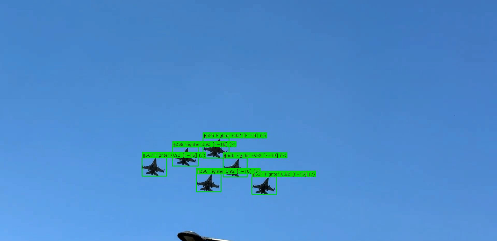
*Six F-16 fighters detected and classified with 0.92–0.93 confidence, each with a unique track ID and Swin Transformer fine-grained identification.*

## Overview

VSHORAD combines **YOLOv8** object detection, **ByteTrack** multi-object tracking, and **Swin Transformer** fine-grained classification into a unified pipeline with intelligent sensor fusion. The system detects aircraft in video streams, tracks them across frames, and identifies specific types from 56 classes across 12 meta-categories.

### Key Results

| Metric | Value |
|--------|-------|
| Detection mAP@0.5 | **0.924** |
| Detection mAP@0.5:0.95 | **0.756** |
| Classification Top-1 Accuracy | **96.53%** |
| Classification Top-5 Accuracy | **99.27%** |
| Aircraft Classes | **56** fine-grained types |
| YOLO Meta-categories | **12** |
| Synthetic Training Images | **~180,000** |
| Real-time FPS (Embedded tier) | **47.0** |

### Architecture

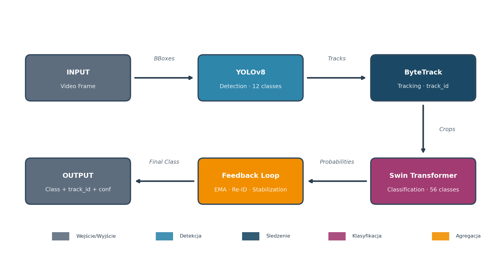

The pipeline processes each video frame through four stages: detection (YOLOv8, 12 classes), tracking (ByteTrack with Re-ID), classification (Swin Transformer, 56 classes), and fusion (EMA aggregation with stability checks).

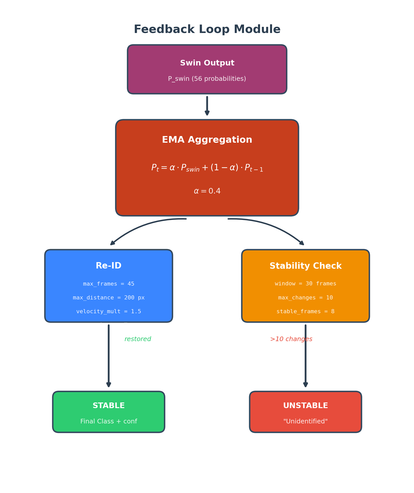

The Feedback Loop module aggregates Swin classification probabilities via Exponential Moving Average (α=0.4), performs Re-Identification of lost tracks using velocity prediction, and flags unstable classifications as "Unidentified".

### Three Deployment Tiers

| Tier | YOLO | Swin | FPS (L4) | Use Case |
|------|------|------|----------|----------|
| **Strategic** | YOLOv8l @ 1280px | Swin-Base @ 384px | 24.5 | Command center |
| **Tactical** | YOLOv8m @ 960px | Swin-Small @ 224px | 41.2 | Mobile station |
| **Embedded** | TensorRT FP16 @ 640px | TensorRT FP16 | 47.0 | Vehicle-mounted |

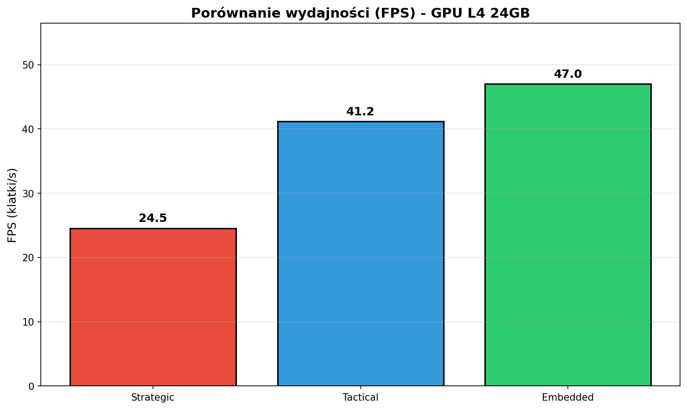

## Quick Start

```bash
# Clone and install
git clone https://github.com/Kierat1992/VSHORAD-Aircraft-Detection.git
cd VSHORAD-Aircraft-Detection
pip install -r requirements.txt

# Run inference (requires weights — see below)
python run.py --tier strategic --video test.mp4
python run.py --tier tactical --video test.mp4 --output results/
python run.py --tier embedded --video test.mp4 --max-frames 300
```

### Python API

```python
from src.system import VSHORADSystem
from src.config import Tier

system = VSHORADSystem(
    yolo_weights="weights/strategic/yolov8l_1280_best.pt",
    swin_weights="weights/strategic/swin_base_384_best.pth",
    tier=Tier.STRATEGIC,
)

results = system.process_frame(frame, frame_idx=0)
for det in results["detections"]:
    print(f"Track #{det['track_id']}: {det['final_label']} ({det['final_conf']:.2f})")
    # e.g. Track #325: Fighter (0.92) [F-16]
```

## Model Weights

Pre-trained weights are **not included** in this repository due to size and IP protection.

**Available upon request for research purposes** — contact: `jedrek.rychter@gmail.com`

```
weights/
├── strategic/
│   ├── yolov8l_1280_best.pt
│   └── swin_base_384_best.pth
├── tactical/
│   ├── yolov8m_960_best.pt
│   └── swin_small_224_best.pth
└── embedded/
    ├── yolov8m_640_fp16.engine
    └── swin_small_224_fp16.engine
```

## Results

### Detection (YOLOv8)

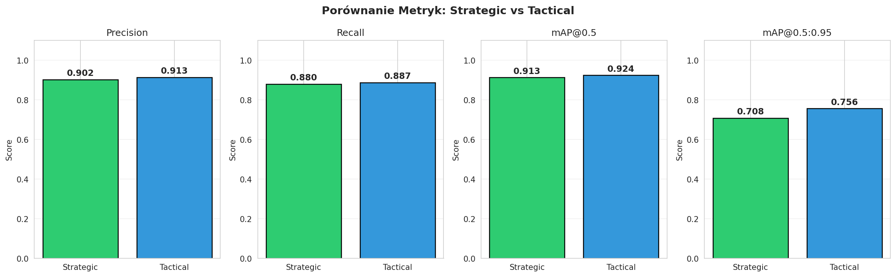

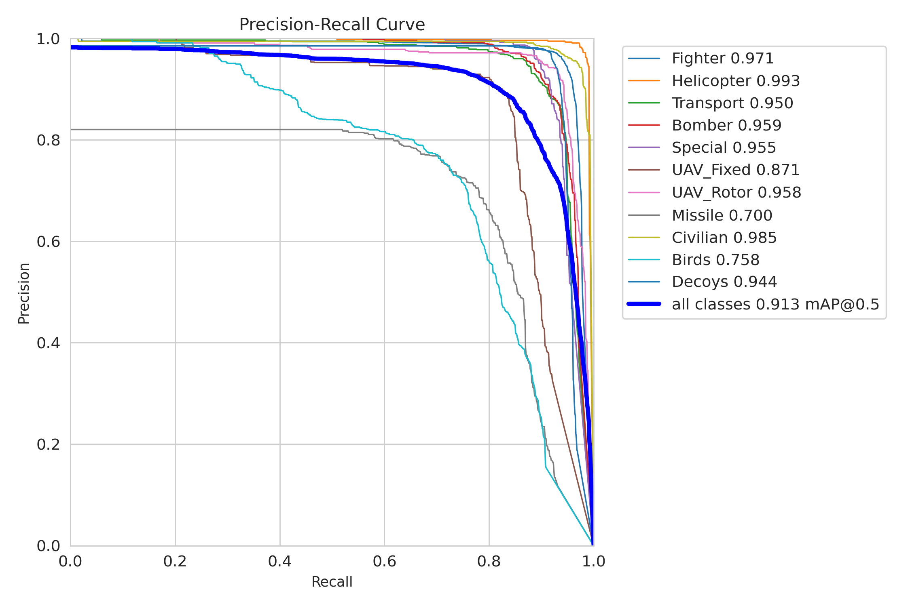

Per-class PR curves show excellent performance across most categories, with Helicopter (0.993) and Civilian (0.985) achieving the highest AP, while Missile (0.700) and Birds (0.758) remain the most challenging.

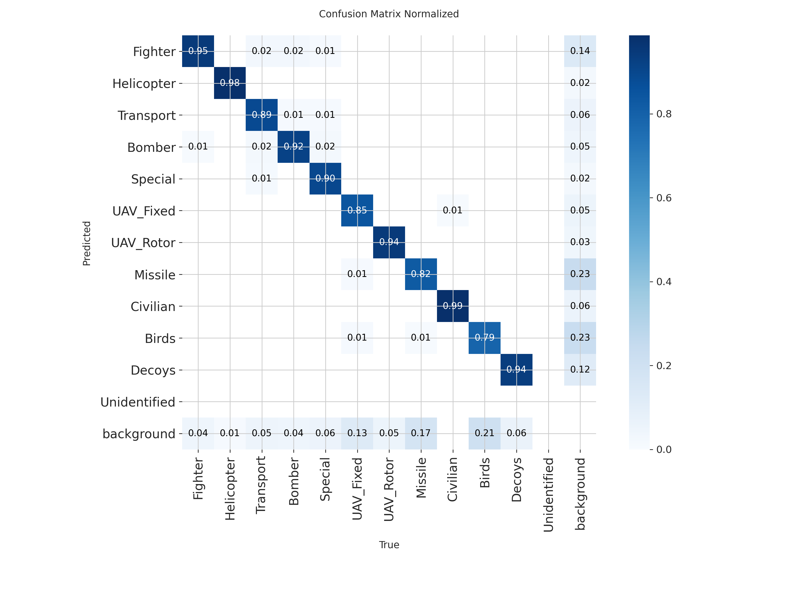

### Classification (Swin Transformer)

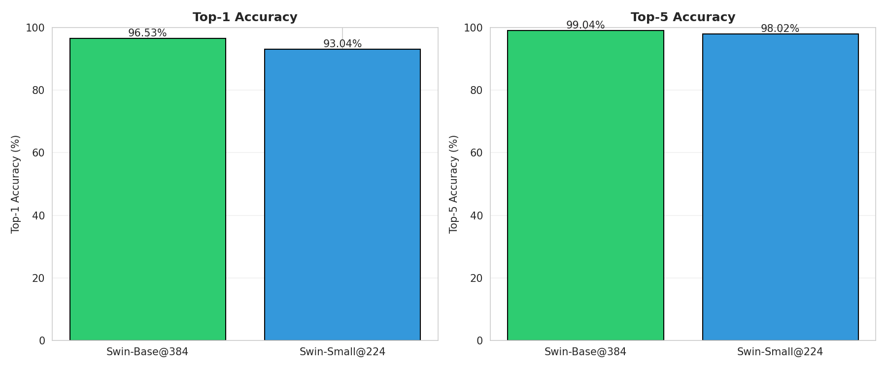

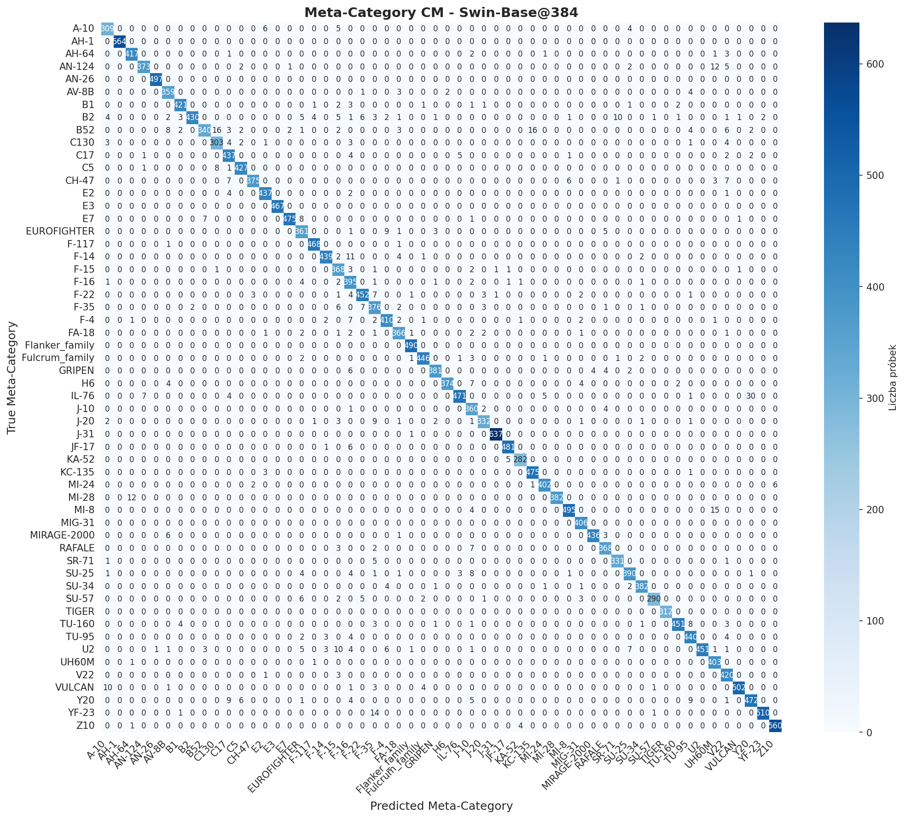

The 56×56 confusion matrix shows strong diagonal dominance. Most errors occur between visually similar aircraft (e.g., F-22/YF-23, Flanker/Fulcrum families).

### Explainability (Grad-CAM)

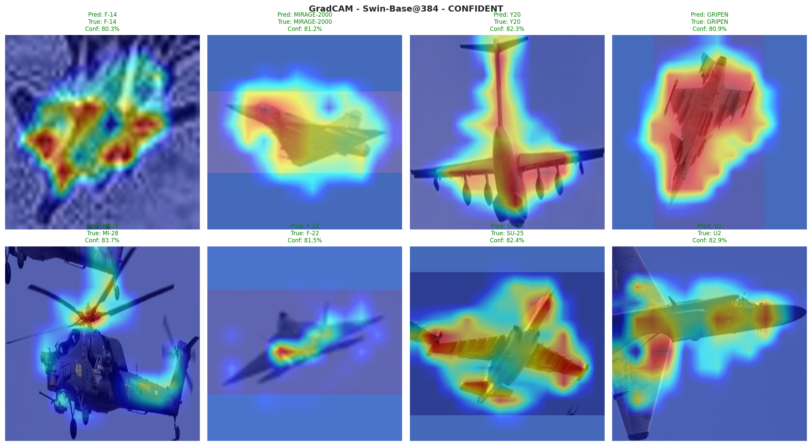

Grad-CAM attention maps confirm the model focuses on discriminative features: wing shapes, engine intakes, tail configurations, and rotor assemblies.

### System Demo

| F-16 Formation (6 aircraft) | AH-64 Apache (3 helicopters) |
|:---:|:---:|
|  | 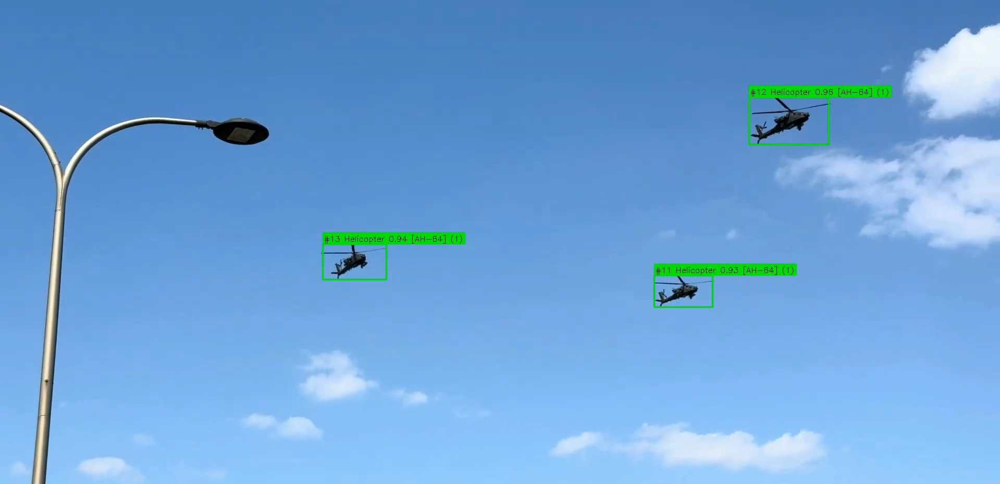 |

## Project Structure

```
VSHORAD-Aircraft-Detection/
├── src/
│   ├── __init__.py            # Package init, public API
│   ├── config.py              # Configurations, class mappings, tier definitions
│   ├── system.py              # VSHORADSystem — main orchestrator
│   ├── video.py               # Video processing & visualization
│   ├── detection/             # YOLOv8 + ByteTrack wrapper
│   ├── classification/        # Swin Transformer wrapper
│   ├── tracking/              # Track management, Re-ID, bbox smoothing
│   └── fusion/                # YOLO/Swin sensor fusion engine
├── training/                  # Colab training notebooks
│   ├── 01_train_strategic.ipynb
│   ├── 02_train_tactical.ipynb
│   └── 03_export_embedded.ipynb
├── notebooks/                 # Evaluation & analysis
│   ├── eval_yolo.ipynb
│   ├── eval_swin.ipynb
│   └── eval_latency.ipynb
├── docs/
│   ├── architecture.md
│   └── dataset.md
├── assets/                    # Diagrams, plots, demo screenshots
├── run.py                     # CLI entry point
├── requirements.txt
└── LICENSE
```

## Dataset


The training dataset was generated using a hybrid pipeline combining real photographs, Blender-rendered synthetic images, and offline augmentations:

- **YOLO dataset**: 36,271 images across 12 meta-categories (75/17/8% train/val/test split)
- **Swin dataset**: 140,000 images across 56 fine-grained types, balanced at 2,500 images/class
- **Synthetic data**: ~180,000 renders in Blender with randomized backgrounds, lighting, camera angles, and atmospheric conditions
- **Real data**: Curated photographs for validation and domain adaptation

See [docs/dataset.md](docs/dataset.md) for the full generation pipeline.

## Training

| Notebook | Description | GPU | Time |
|----------|-------------|-----|------|
| `training/01_train_strategic.ipynb` | YOLOv8l + Swin-Base | A100 | ~45h |
| `training/02_train_tactical.ipynb` | YOLOv8m + Swin-Small | L4/T4 | ~55h |
| `training/03_export_embedded.ipynb` | TensorRT FP16/INT8 | T4+ | ~1h  |

| Notebook | Description |
|----------|-------------|
| `notebooks/eval_yolo.ipynb` | Training curves, per-class mAP, confusion matrices |
| `notebooks/eval_swin.ipynb` | 56×56 confusion matrix, GradCAM, Top-K |
| `notebooks/eval_latency.ipynb` | Component + pipeline latency across tiers |

## Roadmap & Known Limitations

This project is a first working prototype developed as a solo engineering thesis. The sections below outline known limitations and planned improvements for future development.

### Detection Improvements

- **Dedicated small-object head**: Current YOLOv8 struggles with very small targets (drones, birds at long range). A separate detection branch optimized for sub-32px objects would significantly improve UAV and bird detection performance.
- **Civilian class rebalancing**: The Civilian class underperforms due to oversized, non-G2A images in the training set. Regenerating this class with proper Ground-to-Air synthetic renders would bring it in line with other categories.
- **Expanded aircraft library**: Current coverage is 56 types. Operational deployment would require 100+ types including regional variants, newer platforms (B-21, KF-21, Su-75), and commercial airliners.

### Classification & Fusion

- **Feedback loop refinement**: The current unidentified detection mechanism (label oscillation threshold) is a simple heuristic. A more principled approach using entropy of the EMA distribution or a dedicated uncertainty head would improve reliability.
- **Multi-frame crop fusion**: Currently Swin classifies individual crops. Aggregating features across multiple frames before classification (temporal attention) could improve accuracy for difficult angles.

### Tracking

- **Appearance-based Re-ID**: Current Re-ID uses only position and velocity prediction. Adding a lightweight appearance embedding (e.g., OSNet) would dramatically improve track recovery after prolonged occlusion.
- **Handling extreme maneuvers**: Rapid direction changes, flare deployment, and formation splits can confuse the Kalman filter. Adaptive motion models or transformer-based trajectory prediction would help.

### Engineering & Deployment

- **C++ inference pipeline**: The current Python implementation is a research prototype. Production deployment in defense systems would require rewriting the inference pipeline in C++ using TensorRT C++ API and CUDA directly, targeting RTOS-compatible execution on embedded platforms.
- **Thermal/IR sensor fusion**: The system currently operates on visible-spectrum video only. Extending to LWIR (thermal) imagery would enable night operation and improve detection of targets using IR countermeasures.
- **Automated test suite**: Adding unit tests for tracking logic, fusion rules, and edge cases (occlusion, label oscillation, Re-ID) is necessary before any deployment beyond research use.
- **Containerization**: Docker-based deployment for reproducible inference environments across different hardware configurations.

### Dataset

- **More synthetic G2A data**: Current synthetic pipeline covers standard conditions well, but needs expansion for extreme weather (heavy rain, snow, fog), nighttime IR scenarios, and dense multi-target formations.
- **Real-world validation**: All current metrics are on synthetic/curated test sets. Field testing with actual observation camera footage is essential for validating real-world performance.

> This is realistically a 2+ year effort for a dedicated team to bring from prototype to production-grade system. The current version demonstrates the architectural approach and validates the core pipeline.
## Citation

```bibtex
@thesis{rychter2026vshorad,
    title={Optical Detection and Classification of Aircraft for VSHORAD Systems},
    author={Rychter, Jędrzej},
    year={2026},
    school={Politechnika Bydgoska (Bydgoszcz University of Technology)}
}
```

## License

MIT License. See [LICENSE](LICENSE) for details.

---

*Engineering thesis at Bydgoszcz University of Technology, graded 5.0/5.0, with reviewer praise for publication-quality work.*
