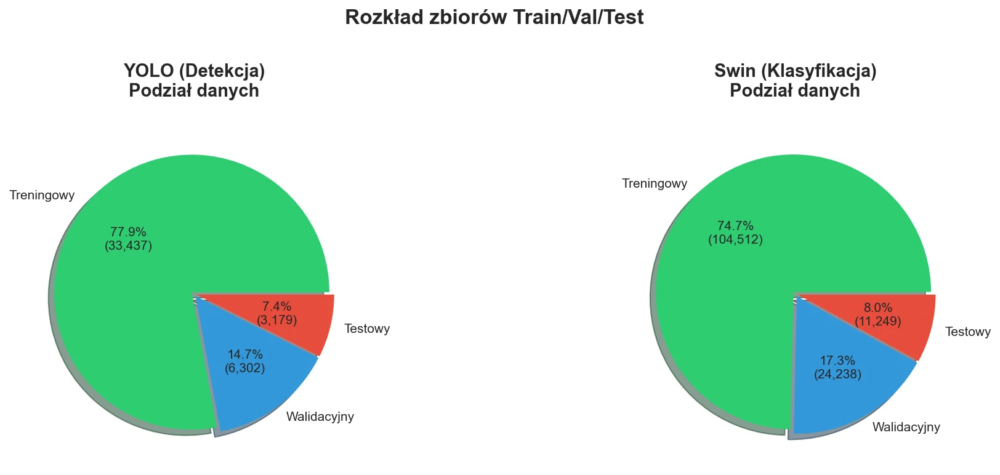
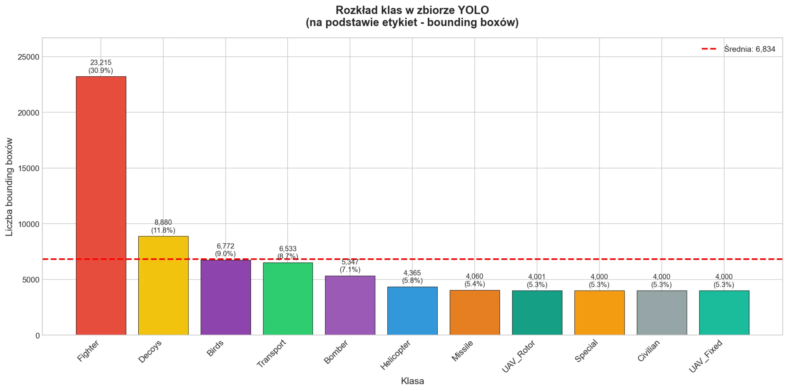
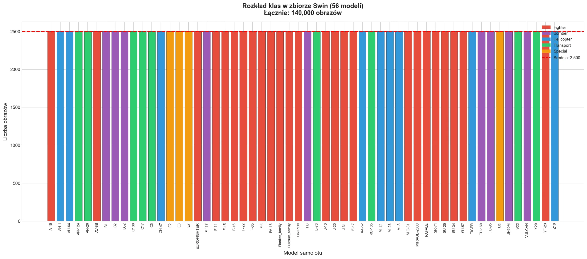

# Dataset Generation

> Hybrid data pipeline combining real photographs, Blender synthetic renders, and offline augmentations for training VSHORAD detection and classification models.

## Overview

Two separate datasets were created for the system's two tasks:

| Dataset | Task | Images | Classes | Resolution |
|---------|------|--------|---------|------------|
| **Skydetect Balanced YOLO** | Detection | 42,918 images (75,173 bboxes) | 12 meta-categories | 1280×1280 |
| **Skydetect Balanced Swin** | Classification | 140,000 crops | 56 fine-grained types | Variable (resized at inference) |

## Why Synthetic Data?

Existing public datasets have critical limitations for VSHORAD:

| Dataset | Classes | Images | Limitation |
|---------|---------|--------|-----------|
| MTARSI | 20 | 9,385 | Satellite perspective only |
| Military Aircraft (Kaggle) | 96 | 22,309 | Side/mixed views, no bboxes |
| Aircraft Detection (Roboflow) | 5 | 3,500 | Too few classes |
| Drone Detection (Roboflow) | 1 | 6,999 | Single class |
| **VSHORAD (this work)** | **56/12** | **182,918** | — |

Key gaps: no **Ground-to-Air (G2A)** perspective (characteristic for VSHORAD operators looking up), missing Russian/Chinese aircraft, no IR decoy (flare) representations, and severe class imbalance.

## Synthetic Generation Pipeline (Blender)

The pipeline uses Blender 5.0's Python API with modular architecture:

| Module | Function |
|--------|----------|
| `SceneManager` | Scene lifecycle, object cleanup |
| `AircraftLoader` | Load 3D models from .blend files |
| `CameraManager` | Ground-to-Air camera positioning |
| `LightingManager` | HDRI environment + sun lighting |
| `OcclusionManager` | Clouds, branches, buildings |
| `AtmosphereManager` | Fog, rain, snow effects |
| `LabelGenerator` | YOLO bbox labels + metadata |
| `FlaresGenerator` | IR thermal decoy generation |

### 3D Models

Aircraft models sourced from Sketchfab, each standardized through: scale normalization (wingspan in meters), landing gear retraction (cruise configuration), geometry repair, and Cycles material optimization.

### Camera Configuration (G2A)

| Parameter | Range | Description |
|-----------|-------|-------------|
| Elevation angle | 15°–80° | 15° = distant low approach, 80° = near overhead |
| Azimuth | 0°–360° | Full directional coverage |
| Focal length | 50–200mm | Wide-angle early warning → telephoto tracking |
| Distance (× wingspan) | 2.0–25.0 | Close fill → distant dot |

Distance distribution is skewed toward far range: 10% close, 35% medium, 55% far — reflecting operational reality where most observations involve distant targets.

### Rendering

| Parameter | Value |
|-----------|-------|
| Resolution | 1280×1280 px |
| Engine | Cycles (GPU) |
| Samples | 128 (noise-free, ~8–15s/image) |
| Device | RTX 3060 6GB (CUDA) |
| Output | PNG, 8-bit |

### Lighting (HDRI)

| Condition | Share | Description |
|-----------|-------|-------------|
| Day clear | 40% | Sunny, cloudless |
| Day cloudy | 30% | Overcast sky |
| Sunset/sunrise | 20% | Low sun, silhouettes, lens flare |
| Night | 5% | Limited visibility |
| Overcast | 5% | Full cloud cover |

### IR Flare Generation

600 scenes with thermal decoys across four deployment patterns:

| Pattern | Weight | Flares | Description |
|---------|--------|--------|-------------|
| Burst | 35% | 8–18 | Rapid defensive burst |
| Defensive | 30% | 12–22 | Intensive evasion maneuver |
| Sequence | 20% | 5–10 | Preventive single-flare intervals |
| Angel | 15% | 14–24 | C-130 style spiral pattern |

## YOLO Dataset (Detection)

**12 meta-categories**: Fighter, Helicopter, Transport, Bomber, Special, UAV_Fixed, UAV_Rotor, Missile, Civilian, Birds, Decoys, Unidentified

Key statistics:
- 42,918 images with 75,173 bounding boxes
- Average 1.75 objects per image (max 243 in flare scenes)
- 904 multi-class images (e.g., Fighter + Decoys)
- Fighter class intentionally overrepresented (30.9%) due to high intra-class variance (25 different fighter types)
- Train/Val/Test split: ~75/17/8%

Data sources: 58.3% real photographs, 26.0% synthetic renders, 14.2% offline augmentations, 1.5% flare scenes.

## Swin Dataset (Classification)

**56 fine-grained types**: A-10, AH-1, AH-64, AN-124, AN-26, AV-8B, B1, B2, B52, C130, C17, C5, CH-47, E2, E3, E7, EUROFIGHTER, F-117, F-14, F-15, F-16, F-22, F-35, F-4, FA-18, Flanker_family, Fulcrum_family, GRIPEN, H6, IL-76, J-10, J-20, J-31, JF-17, KA-52, KC-135, MI-24, MI-28, MI-8, MIG-31, MIRAGE-2000, RAFALE, SR-71, SU-25, SU-34, SU-57, TIGER, TU-160, TU-95, U2, UH60M, V22, VULCAN, Y20, YF-23, Z10

Key statistics:
- 140,000 images total
- Perfectly balanced: 2,500 images per class
- Offline augmentations dominate (66.3%) to achieve balance
- Train/Val/Test split: ~75/17/8%

## Augmentation Strategy

### Offline Augmentations (Dataset Balancing)

Applied before training to balance underrepresented classes:

| Transform | Parameters |
|-----------|-----------|
| Horizontal flip | p=0.5 |
| Rotation | ±15° |
| Brightness/Contrast | ±0.2 |
| Gaussian noise | σ=0.01 |
| JPEG compression | quality 70–95 |

### Online Augmentations (YOLO Training)

Applied during training by the Ultralytics pipeline:

| Transform | Value | Description |
|-----------|-------|-------------|
| Mosaic | 1.0 | Combine 4 images into one |
| Mixup | 0.15 | Blend two images |
| Copy-paste | 0.1 | Paste objects between images |
| Scale | 0.5 | Random resize |
| HSV shifts | H=0.015, S=0.5, V=0.4 | Color jitter |
| Flip LR | 0.5 | Horizontal flip |
| Erasing | 0.2 | Random erasing |

### Online Augmentations (Swin Training)

Applied during classification training via Albumentations:

**Strategic tier** (12 transforms): HorizontalFlip, ShiftScaleRotate, ColorJitter, CLAHE, GaussNoise, ISONoise, GaussianBlur, CoarseDropout, RandomBrightnessContrast, HueSaturationValue, ImageCompression, Normalize + ToTensorV2

**Tactical tier** (6 transforms): Simplified pipeline without CLAHE, CoarseDropout, ISONoise for faster processing.

Both tiers use Mixup (α=0.8) and CutMix (α=1.0) with 50% probability during training.
